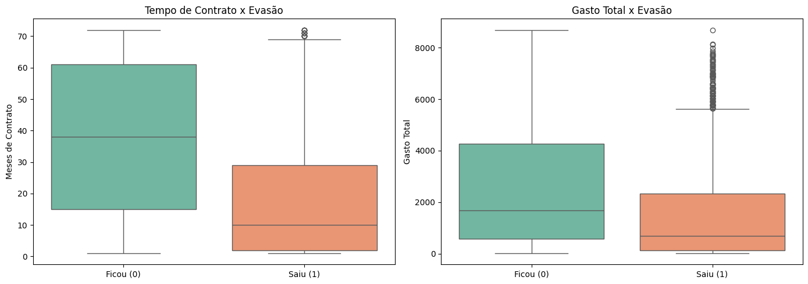

# 📊 Previsão de Evasão de Clientes (Churn) - Telecom X

Este projeto apresenta uma solução completa de **Ciência de Dados** e **Machine Learning** para a empresa Telecom X. O ciclo abrange desde a extração de dados brutos até a criação de um modelo preditivo capaz de antecipar quais clientes têm maior probabilidade de cancelar seus serviços.

## 📌 Contexto do Desafio
A Telecom X enfrentava uma perda significativa de clientes. O objetivo foi percorrer todo o ciclo de dados para gerar insights acionáveis e um modelo de classificação para apoiar estratégias de retenção.

## 🛠️ Etapas do Projeto

### 1. ETL & Análise Exploratória (EDA)
* **Processamento:** Extração de dados JSON via API, tratamento de nulos e normalização de tipos.
* **Insights:** Clientes com contratos mensais e pagamento via boleto eletrônico possuem o maior risco de evasão. Os primeiros 5 meses de contrato são críticos.

### 2. Machine Learning (Modelagem Preditiva)
Nesta segunda fase, treinamos e comparamos modelos de classificação:
* **Regressão Logística:** Selecionada como modelo final por seu excelente equilíbrio entre sensibilidade (Recall) e precisão.
* **Random Forest:** Utilizado para comparação de desempenho.
* **Exportação:** O modelo final foi salvo em formato `.pkl` (Pickle) para futura implantação.

## 📈 Visualizações Principais

#### 1. Fatores de Risco (Importância das Variáveis)
Identificamos que o comportamento de gastos e o tempo de contrato são os maiores preditores de churn.

#### 2. Desempenho do Modelo (Matriz de Confusão)
O modelo de Regressão Logística demonstrou alta eficácia em identificar clientes em risco.

#### 3. Perfil de Tempo de Contrato
Visualização da distribuição do tempo de casa (Tenure) entre clientes que ficaram e saíram.

## 💰 Impacto de Negócio
Através de uma função de **Custo Ponderado**, validamos que a utilização do modelo permite à Telecom X focar seus recursos em clientes de alto risco, reduzindo drasticamente o prejuízo financeiro causado pela evasão não detectada.

## 📁 Estrutura deste Repositório
* **/notebooks**: Arquivos `.ipynb` com a análise completa e o treinamento dos modelos.
* **/data**: Dataset `TelecomX_Dados_Limpos.csv` tratado.
* **/models**: Modelo final treinado (`model_LogisticRegression.pkl`).
* **/img**: Gráficos e visualizações geradas.

---
**Projeto desenvolvido por: Bruno Gabriel**
