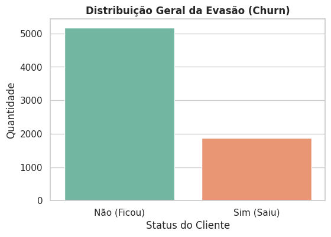
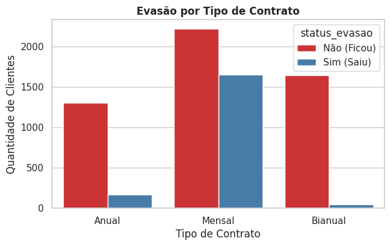
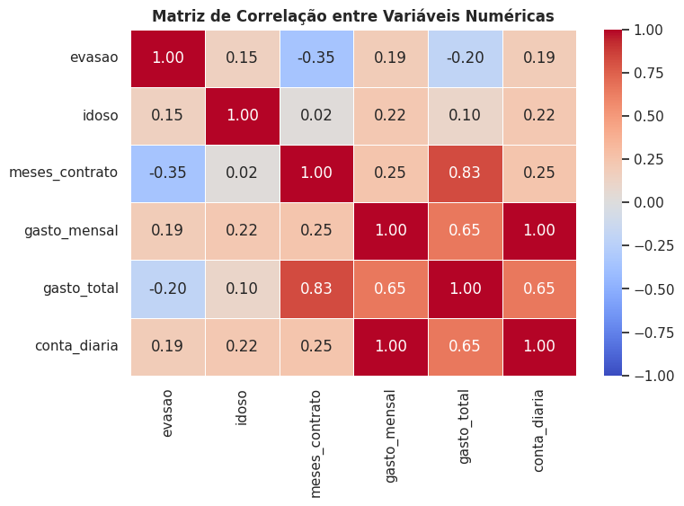
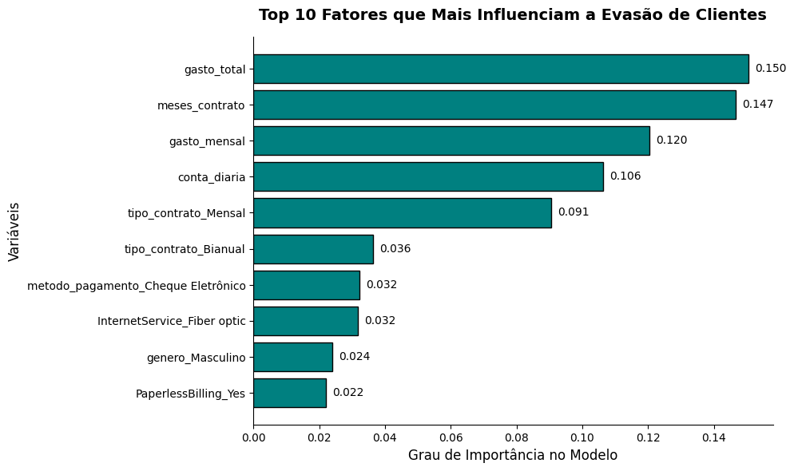
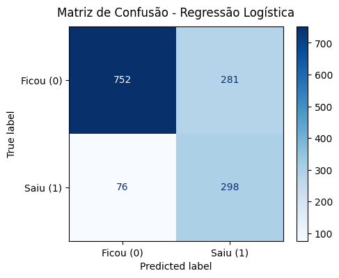
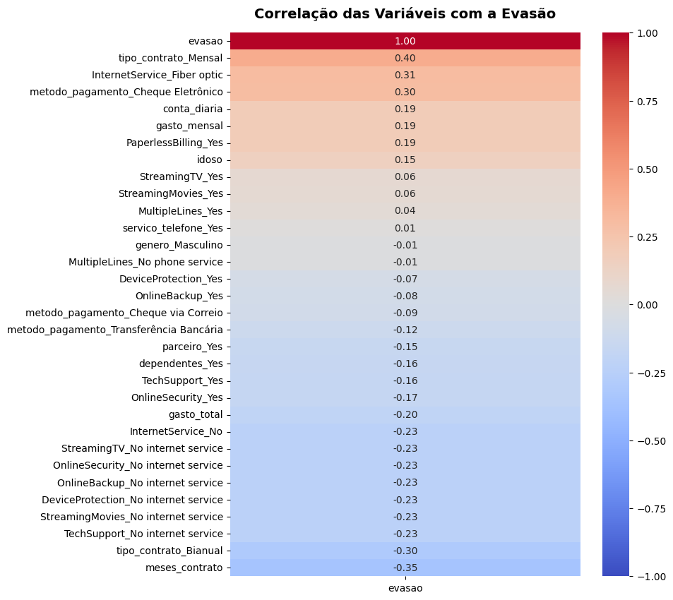

# 📊 Telecom X: Solução End-to-End de Data Science e Machine Learning

Este projeto apresenta uma solução completa de **Data Science** para a empresa fictícia **Telecom X**. O objetivo foi identificar os principais motivos que levam os clientes a cancelarem seus serviços (Churn) e propor estratégias baseadas em dados para retenção.

## 📌 Contexto do Desafio
A Telecom X enfrentava uma perda significativa de clientes. Recebemos um banco de dados bruto via API em formato JSON aninhado. O desafio foi percorrer todo o ciclo **ETL (Extract, Transform, Load)** e realizar uma **Análise Exploratória (EDA)** profunda para gerar insights acionáveis.

## 🛠️ Etapas do Projeto

##Parte 1 - Análise de evasão de clientes
### 1. ETL & Limpeza (Processamento de Dados)
* **Extração:** Consumo de dados brutos aninhados via API.
* **Flattening:** Achatamento de estruturas JSON complexas para formato tabular (Pandas).
* **Limpeza:** Tratamento de valores nulos, correção de tipos de dados (faturamento total) e remoção de registros inconsistentes.
* **Padronização (Opcional):** Tradução de colunas e dados para Português e conversão da variável alvo para formato binário (1 e 0).

### 2. Engenharia de Variáveis (Métricas Extras)
* Criação da métrica **`conta_diaria`**: Cálculo do custo diário do cliente para identificar sensibilidade ao preço.

### 3. Análise Exploratória (Insights Chave)
* **Contratos:** Clientes com contratos mensais possuem taxa de evasão drasticamente superior aos de contrato anual.
* **Método de Pagamento:** O pagamento via boleto (Electronic Check) é um forte indicador de churn precoce.
* **Fidelidade:** Os primeiros 5 meses de contrato são o período de maior risco para a empresa.
* **Matriz de Correlação:** Validação matemática da relação entre gastos elevados e probabilidade de cancelamento.

## 📈 Resultados e Recomendações
Com a análise, identificamos que o perfil de risco é o **novo cliente, com plano mensal e pagamento manual**.  
**Ações sugeridas:**
1. Incentivos financeiros para migração de planos mensais para anuais.
2. Bonificações para clientes que cadastrarem débito automático/cartão.
3. Régua de relacionamento específica para os primeiros 90 dias do cliente.

### 📈 Visualizações Principais

#### 1. Distribuição da Evasão

#### 2. Impacto do Tipo de Contrato

#### 3. Matriz de Correlação entre Variáveis

---

## 🤖 Parte 2: Machine Learning e Inteligência de Negócio

Nesta fase, transformamos os insights da análise anterior em uma solução preditiva automatizada.

### 🔧 Preparação de Atributos (Feature Engineering)
- Aplicação de **Label Encoding** e **One-Hot Encoding** para transformar categorias de texto em dados numéricos processáveis pelo modelo.  
- Uso de **StandardScaler** para normalizar as escalas de gasto mensal e total, evitando que valores altos distorçam o aprendizado.

### 🤖 Treinamento de Modelos
- **Regressão Logística**: Implementada como modelo base por sua excelente interpretabilidade e rapidez.  
- **Random Forest**: Utilizada para capturar relações não lineares complexas entre as variáveis.

### ⚖️ Balanceamento de Classes
Como o número de clientes que não saem é muito maior, aplicamos o parâmetro  
`class_weight='balanced'` para garantir que o modelo não ignore a minoria que cancela (**Churn**).

### 📊 Métrica de Sucesso (Business Score)
- Desenvolvimento de uma função de **Custo Ponderado personalizada**.  
- Esta métrica vai além da acurácia técnica, calculando o impacto financeiro real de cada erro do modelo (**Falsos Negativos vs. Falsos Positivos**).

### 📦 Exportação do Modelo
Finalização com a biblioteca **Pickle**, gerando o arquivo `.pkl` que permite integrar a inteligência do projeto em sistemas de produção ou dashboards em tempo real.

---

## 📈 Resultados Visuais

#### 1. Fatores de Risco (Feature Importance)
O modelo identificou que o comportamento de gastos e o tempo de contrato são os maiores preditores.  

#### 2. Matriz de Confusão (Desempenho)
A Regressão Logística permitiu capturar a maioria dos clientes em risco (Recall elevado).  

#### 3. Correlação de Variáveis
Análise matemática da relação entre as variáveis de serviço e a evasão.  

---

## 💰 Impacto de Negócio
A implementação deste modelo permite à Telecom X:
1.  **Reduzir o Prejuízo:** Ao identificar o churn preventivamente, a empresa evita o custo de aquisição de um novo cliente (CAC).
2.  **Ações Direcionadas:** Focar campanhas de retenção em clientes com contratos mensais e alta conta diária.

## 📁 Estrutura do Repositório
* **/data**: Base de dados limpa e tratada.
* **/notebooks**: Notebooks divididos por fase (EDA e Machine Learning).
* **/models**: Arquivo `.pkl` do modelo treinado.
* **/img**: Gráficos para documentação e apresentações.

---

**Projeto desenvolvido por: Bruno Gabriel**
